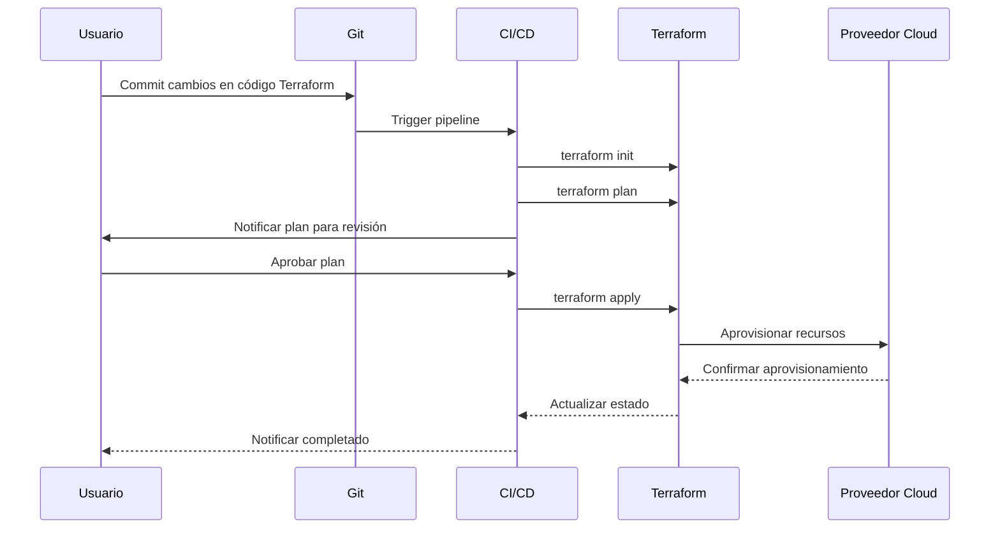
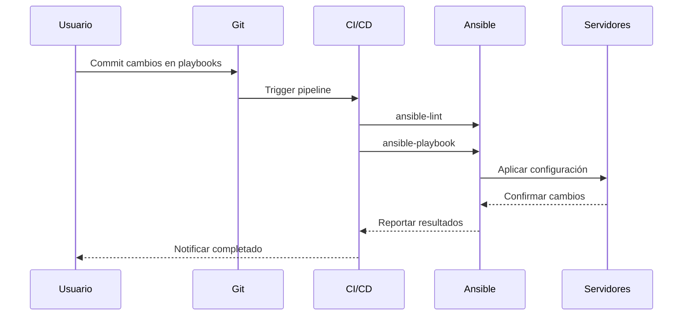
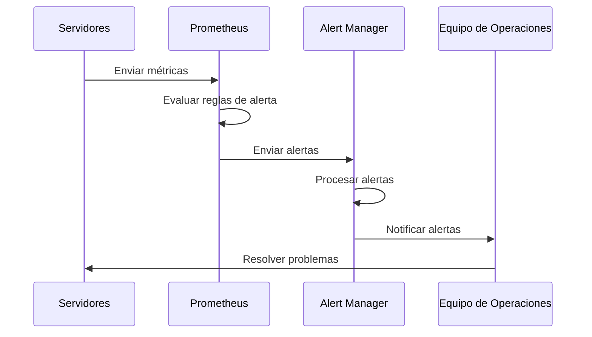

# Arquitectura Detallada: Gestión de Infraestructura Tecnológica

## Introducción

Este documento describe la arquitectura detallada del sistema de gestión de infraestructura tecnológica, diseñado para administrar entornos híbridos que combinan infraestructura on-premise y en la nube. La arquitectura implementa el enfoque de Infraestructura como Código (IaC) para automatizar el aprovisionamiento, configuración y mantenimiento de recursos tecnológicos.

## Visión General de la Arquitectura

La arquitectura del sistema se divide en varias capas interconectadas que trabajan juntas para proporcionar una solución completa de gestión de infraestructura:

```
┌─────────────────────────────────────────────────────────────────┐
│                     Capa de Orquestación                        │
│                                                                 │
│  ┌───────────────┐    ┌───────────────┐    ┌───────────────┐    │
│  │   Terraform   │    │    Ansible    │    │  CI/CD Tools  │    │
│  └───────────────┘    └───────────────┘    └───────────────┘    │
└─────────────────────────────────────────────────────────────────┘
                              │
                              ▼
┌─────────────────────────────────────────────────────────────────┐
│                      Capa de Recursos                           │
│                                                                 │
│  ┌───────────────┐    ┌───────────────┐    ┌───────────────┐    │
│  │  On-Premise   │    │  Public Cloud │    │ Private Cloud │    │
│  └───────────────┘    └───────────────┘    └───────────────┘    │
└─────────────────────────────────────────────────────────────────┘
                              │
                              ▼
┌─────────────────────────────────────────────────────────────────┐
│                     Capa de Monitoreo                           │
│                                                                 │
│  ┌───────────────┐    ┌───────────────┐    ┌───────────────┐    │
│  │   Prometheus  │    │    Grafana    │    │ Alert Manager │    │
│  └───────────────┘    └───────────────┘    └───────────────┘    │
└─────────────────────────────────────────────────────────────────┘
                              │
                              ▼
┌─────────────────────────────────────────────────────────────────┐
│                     Capa de Seguridad                           │
│                                                                 │
│  ┌───────────────┐    ┌───────────────┐    ┌───────────────┐    │
│  │    Políticas  │    │    Cifrado    │    │   Firewalls   │    │
│  └───────────────┘    └───────────────┘    └───────────────┘    │
└─────────────────────────────────────────────────────────────────┘
```

## Componentes Principales

### 1. Capa de Orquestación

#### 1.1 Terraform

Terraform se utiliza para el aprovisionamiento de infraestructura declarativa en múltiples proveedores de nube y entornos on-premise.

**Responsabilidades:**
- Definición de infraestructura como código
- Aprovisionamiento de recursos en AWS, Azure, GCP y VMware
- Gestión del estado de la infraestructura
- Planificación y aplicación de cambios de infraestructura

**Estructura de Directorios:**
```
src/terraform/
├── aws/           # Configuraciones para AWS
├── azure/         # Configuraciones para Azure
├── gcp/           # Configuraciones para Google Cloud
├── vmware/        # Configuraciones para VMware
└── modules/       # Módulos reutilizables
```

#### 1.2 Ansible

Ansible se utiliza para la configuración y gestión de servidores y aplicaciones.

**Responsabilidades:**
- Configuración de sistemas operativos
- Instalación y configuración de software
- Despliegue de aplicaciones
- Tareas de mantenimiento automatizadas

**Estructura de Directorios:**
```
src/ansible/
├── inventories/   # Inventarios para diferentes entornos
├── playbooks/     # Playbooks para diferentes tareas
├── roles/         # Roles reutilizables
└── vars/          # Variables para diferentes entornos
```

#### 1.3 CI/CD Tools

Herramientas de integración y despliegue continuo para automatizar el ciclo de vida de la infraestructura.

**Responsabilidades:**
- Automatización de pruebas de infraestructura
- Validación de configuraciones
- Despliegue automatizado de cambios
- Integración con sistemas de control de versiones

**Estructura de Directorios:**
```
.github/workflows/
├── terraform-validate.yml
├── terraform-plan.yml
├── terraform-apply.yml
└── ansible-lint.yml
```

### 2. Capa de Recursos

#### 2.1 On-Premise

Gestión de recursos locales en centros de datos propios.

**Componentes:**
- Servidores físicos
- Almacenamiento local
- Redes locales
- Virtualización (VMware, KVM, etc.)

#### 2.2 Public Cloud

Gestión de recursos en proveedores de nube pública.

**Componentes:**
- Instancias de computación (EC2, VMs, etc.)
- Almacenamiento en la nube (S3, Blob Storage, etc.)
- Servicios gestionados (RDS, Lambda, etc.)
- Redes virtuales (VPC, VNET, etc.)

#### 2.3 Private Cloud

Gestión de recursos en entornos de nube privada.

**Componentes:**
- OpenStack
- VMware vCloud
- Azure Stack
- AWS Outposts

### 3. Capa de Monitoreo

#### 3.1 Prometheus

Sistema de monitoreo y alerta para recopilar métricas de infraestructura.

**Responsabilidades:**
- Recopilación de métricas
- Almacenamiento de series temporales
- Evaluación de reglas de alerta
- Exposición de API para consultas

#### 3.2 Grafana

Plataforma de visualización para métricas y logs.

**Responsabilidades:**
- Visualización de métricas
- Creación de dashboards
- Configuración de alertas visuales
- Integración con fuentes de datos

#### 3.3 Alert Manager

Sistema de gestión de alertas para notificaciones y escalado.

**Responsabilidades:**
- Deduplicación de alertas
- Agrupación de alertas
- Enrutamiento de notificaciones
- Silenciamiento y inhibición de alertas

### 4. Capa de Seguridad

#### 4.1 Políticas

Definición y aplicación de políticas de seguridad.

**Componentes:**
- Políticas de IAM
- RBAC (Control de Acceso Basado en Roles)
- Políticas de red
- Políticas de cumplimiento

#### 4.2 Cifrado

Mecanismos de cifrado para proteger datos sensibles.

**Componentes:**
- Cifrado en reposo
- Cifrado en tránsito
- Gestión de claves
- Certificados SSL/TLS

#### 4.3 Firewalls

Protección de perímetro y segmentación de red.

**Componentes:**
- Firewalls de red
- Grupos de seguridad
- WAF (Web Application Firewall)
- IDS/IPS (Sistemas de Detección/Prevención de Intrusiones)

## Flujos de Trabajo Principales

### 1. Aprovisionamiento de Nueva Infraestructura



### 2. Configuración de Servidores



### 3. Monitoreo y Alertas



## Consideraciones de Seguridad

### Gestión de Secretos

- Uso de HashiCorp Vault para almacenamiento seguro de secretos
- Integración con Terraform y Ansible para inyección segura de credenciales
- Rotación automática de secretos
- Auditoría de acceso a secretos

### Seguridad de Red

- Implementación de principio de mínimo privilegio
- Segmentación de red con VLANs y subredes
- Uso de VPN para acceso remoto seguro
- Implementación de Zero Trust Network Access (ZTNA)

### Cumplimiento y Auditoría

- Registro centralizado de logs
- Auditoría de cambios en infraestructura
- Escaneo regular de vulnerabilidades
- Pruebas de penetración programadas

## Escalabilidad y Alta Disponibilidad

### Estrategias de Escalabilidad

- Diseño modular para escalar componentes individualmente
- Auto-scaling basado en métricas de uso
- Distribución geográfica de recursos
- Balanceo de carga automático

### Alta Disponibilidad

- Implementación multi-región/multi-zona
- Replicación de datos entre regiones
- Failover automático
- Pruebas regulares de recuperación ante desastres

## Integración con Otros Sistemas

- Integración con sistemas de gestión de tickets (JIRA, ServiceNow)
- Integración con herramientas de CMDB
- Integración con sistemas de gestión de costos
- Integración con herramientas de análisis de logs

## Conclusión

Esta arquitectura proporciona un marco completo para la gestión de infraestructura tecnológica en entornos híbridos, implementando prácticas modernas de DevOps e Infraestructura como Código. La combinación de herramientas como Terraform y Ansible, junto con sistemas robustos de monitoreo y seguridad, permite una gestión eficiente, segura y escalable de los recursos tecnológicos.

## Referencias

1. HashiCorp Terraform Documentation: [https://www.terraform.io/docs](https://www.terraform.io/docs)
2. Ansible Documentation: [https://docs.ansible.com](https://docs.ansible.com)
3. Prometheus Documentation: [https://prometheus.io/docs](https://prometheus.io/docs)
4. Grafana Documentation: [https://grafana.com/docs](https://grafana.com/docs)
5. NIST Cloud Computing Standards: [https://www.nist.gov/programs-projects/nist-cloud-computing-program-nccp](https://www.nist.gov/programs-projects/nist-cloud-computing-program-nccp)

